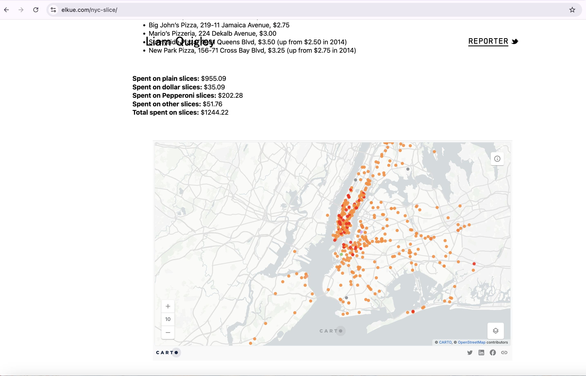

| [home page](https://r-var25.github.io/rvarela_dataviz_portfolio/) | [data viz examples](dataviz-examples) | [critique by design](critique-by-design) | [final project I](final-project-part-one) | [final project II](final-project-part-two) | [final project III](final-project-part-three) |

# Critique by Design: MakeOver Monday Assignment 

## Step One: The Visualization

The screenshot below showcases the data visualization that I chose for this assignment: 

Source: https://elkue.com/nyc-slice/

While looking for possible data visualizations, I tried to find one that spoke to me personally. I have already told all of you that I am from New York City, the Bronx in particular, and how my home has played a huge part in my life. One thing NYC is known for, and we New Yorkers take very seriously, is Pizza. I cannot tell you the total number of slices I have had in my lifetime. I have a vivid memory of getting out of school by 2:45 pm and running with my friends to the nearest pizza parlor to get our daily slice. So, when I came across this data visualization on the MakeOver Monday website, I knew it was a perfect match. I am a New Yorker who loves food, who in fact, is still very passionate about pizza. I was very interested in learning more about the subject. While I was excited to see a map of the five boroughs through pizza, that slowly washed away once I began to look at it more closely.        

## Step Two: The Critique

There were three main issues that I had with this data visualization: 

1. Clarity: There was no title to the map, and the data being showcased on it. Due to this, it took a while to realize what was being shown through the map. The lack of a legend or a key for the map also added to the difficulty in understanding the message of the map.
2. Lack of Narrative: While the interactive map was interesting, the whole visualization ended up coming across as a collection of random data points. There is no narrative being told through these data points, which makes the audience feel like they are wasting their time.
3. Color Scheme: While the use of the red family does coincide with the theme of pizza, it makes the map extremely hard to read as the colors often either overlap or mask each other. It makes the entire map extremely difficult to read, which goes against its purpose.

## Step Three: Sketch a Solution

Here is the first draft of the data visualization I prepared with the dataset. 

    <noscript>
        
    </noscript>
    <object class='tableauViz' style='display:none;'>
        <param name='host_url' value='https%3A%2F%2Fpublic.tableau.com%2F' />
        <param name='embed_code_version' value='3' />
        <param name='site_root' value='' />
        <param name='name' value='makeovermondayWIP_243/Sheet1' />
        <param name='tabs' value='no' />
        <param name='toolbar' value='yes' />
        <param name='static_image' value='https://public.tableau.com/static/images/ma/makeovermondayWIP_243/Sheet1/1.png' />
        <param name='animate_transition' value='yes' />
        <param name='display_static_image' value='yes' />
        <param name='display_spinner' value='yes' />
        <param name='display_overlay' value='yes' />
        <param name='display_count' value='yes' />
        <param name='language' value='en-US' />
    </object>

To create my visualization, I decided that Tableau would be the best tool. While I did have the initial idea of improving on the map, I decided that it did not fit the narrative I wanted to tell. Since the audience of the original visualization was New Yorkers, I decided to appeal to the audience as much as possible with two things that are synonymous with the city, one being pizza, of course, and the second being the MTA, the Metropolitan Transit Authority, specifically the MetroCard. So, I decided the best course of action that would tie these two things in one narrative was the use of a combined line and bar chart. The line would display the average price of a Plain Slice over the years, and the bars would display the number of pizza parlors that changed their price within the year. The MTA Base Fare or MetroCard information has remained relatively constant over the years, so I placed the information on top. I changed the color scheme to orange and blue for better contrast and to make it more visibly accessible. I also finally gave it a title that would reflect the story I am trying to tell.  

## Step Four: Test the Solution

On Monday, March 31st, our class had a MakeOver Monday Session. This was an exercise in class where we reviewed each other's first drafts of our solutions to our original data visualizations. We were each placed into separate groups, and we interviewed each other with questions on our data visualizations. I was placed in group four, where I was the only MEIM while the rest were MSPPM students in their mid-twenties who came from heavy data experience. Here were the five questions I asked them all:

1. What you you see?
2. What do you understand in front of you?
3. Is there anything that is bothering you about the visual?
4. Who do you think the audience is?
5. What would you do differently?

As you could probably infer, great minds do think alike, especially those who come from a similar background. Every one of my group mates gave me the same answers. While this might not seem that helpful on the surface, it was incredibly insightful, as someone with no data background, I was having trouble deciding what was important and necessary to my story. Having people point out the fluff had me focus on what was actually important. 

Below are the answers they gave me:

1. The bars. The bars. The bars
2. No, there is too much going on. Too much information. I can't tell what's going on.
3. Why is the no MetroCard Data on the chart if it's in the title? (I then point it out near the title.) Why is it not in the chart?
4. You're appealing to New Yorkers, right, like the Foodies in particular.
5. Actually, put the MetroCard information in the chart. Get rid of the bars, please.

The main pattern in this feedback was the overall lack of comprehension and clutter. So, with that now under my belt, it is time to go back to the drawing board. 

## Step Five: Build the Solution

The following is my final data visualization for this assignment: 

   

    <noscript>
        
    </noscript>
    <object class='tableauViz' style='display:none;'>
        <param name='host_url' value='https%3A%2F%2Fpublic.tableau.com%2F' />
        <param name='embed_code_version' value='3' />
        <param name='site_root' value='' />
        <param name='name' value='PizzavMetroCard_v2024_3/Sheet3' />
        <param name='tabs' value='no' />
        <param name='toolbar' value='yes' />
        <param name='static_image' value='https://public.tableau.com/static/images/Pi/PizzavMetroCard_v2024_3/Sheet3/1.png' />
        <param name='animate_transition' value='yes' />
        <param name='display_static_image' value='yes' />
        <param name='display_spinner' value='yes' />
        <param name='display_overlay' value='yes' />
        <param name='display_count' value='yes' />
        <param name='language' value='en-US' />
    </object>

    
When I was younger, I often heard that a slice of pizza costs the same as a swipe of a MetroCard. Growing up, we often paid each other back for swipes by buying each other a slice. Over the years, I began to realize that the old anecdote was no longer true, and that my friends and I would be overpaying each other for a fare on the MTA. A plain slice of pizza has been a staple food of New York for a long time. It is a part of our culture. A slice of pizza was often seen as a cheap meal that would be able to fill you up, making it the perfect food for students coming out of school. After all these years, Pizza is now expensive. Many students can no longer afford to eat it every day, and now it is only eaten maybe once a week at most. Pizza, just like NYC, has slowly become more and more unaffordable for its residents. 

The hardest part of this process was narrowing down the most relevant information. I initially believed that showcasing the number of pizza shops changing their prices per year was an important data point. However, after interviews with my classmates who have a data background, I realized that it was superfluous as it did not add to the story I wanted to tell. One of my classmates reminded me that inflation is a thing, so a single shop is not that relevant, i.e., correlation does not equal causation. However, a trend of increasing prices is relevant, as it tells us that there are possible underlying factors that are influencing this pattern. 

I wanted to appeal to my home base as the primary audience for these data visualizations, New Yorkers. So, I made the visual as simple as I possibly could, having the audience be completely surprised by the information being shown and understand that their home is slowly becoming more out of reach per year.

While I did end this assignment on a somber note, I had a great time creating this data visualization. It has let me see how powerful and simple graph can be. 

## References

 Sources:

Sources:
Oldenburg, Ben. “NYC Transit Fare History.” Observable, August 16, 2023. https://observablehq.com/@benoldenburg/nyc-transit-fare-history. 

Quigley, Liam. “NYC Slice.” Liam Quigley. Accessed March 29, 2025. https://elkue.com/nyc-slice/. 
 

## AI Acknowledgements

Chat GBT was used as Tech Support to aid in embedding the visualizations seen above. 

