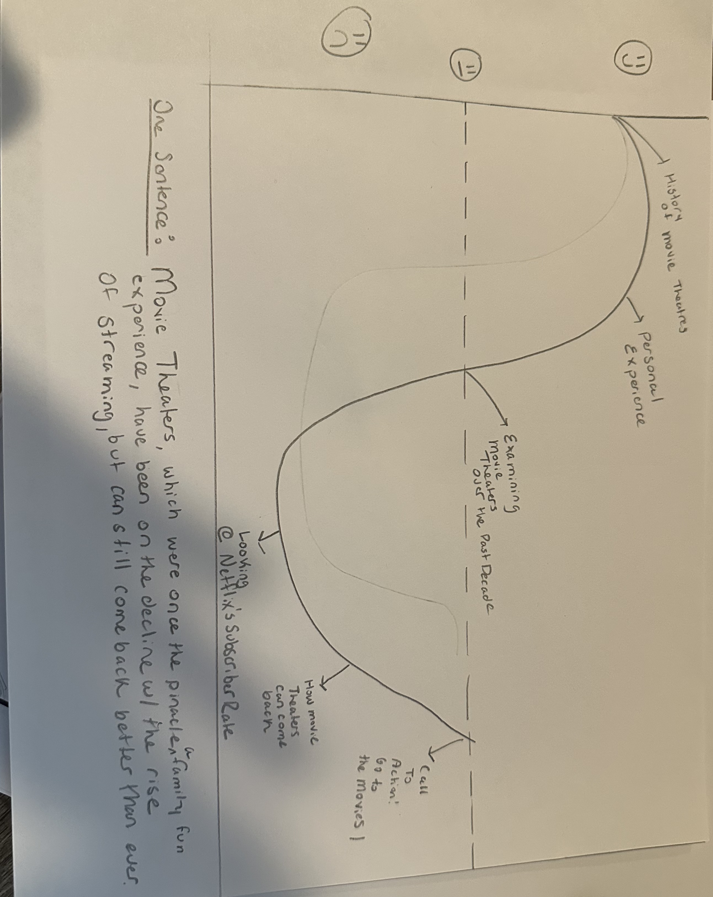
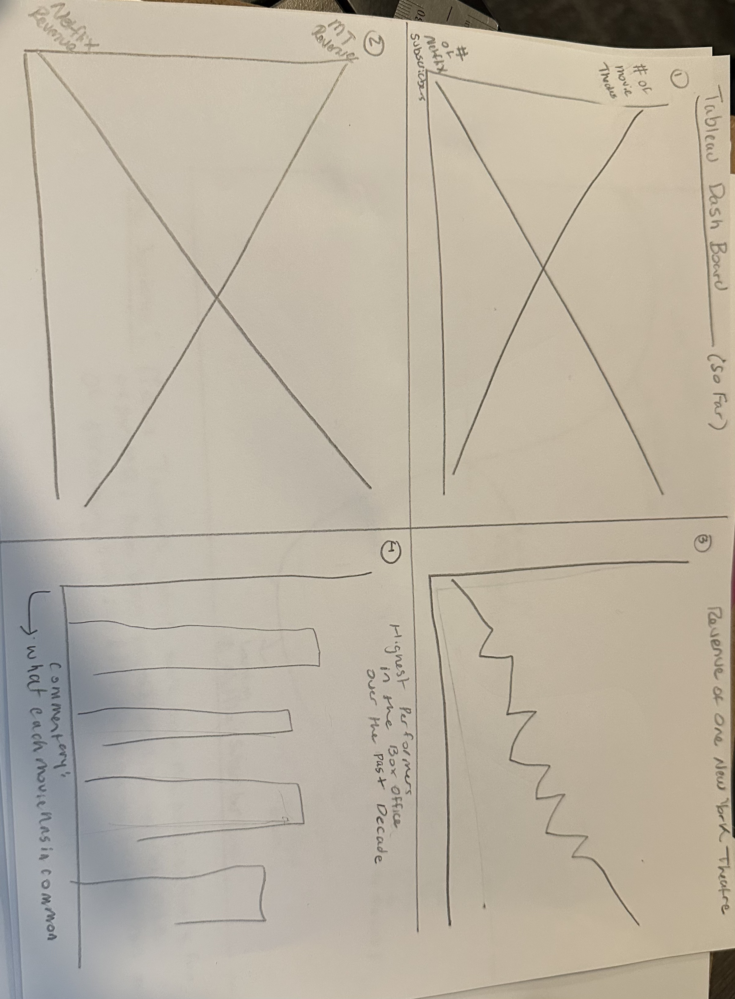

| [home page](https://r-var25.github.io/rvarela_dataviz_portfolio/) | [data viz examples](dataviz-examples) | [critique by design](critique-by-design) | [final project I](final-project-part-one) | [final project II](final-project-part-two) | [final project III](final-project-part-three) |

> Important note: this template includes major elements of Part I, but the instructions on Canvas are the authoritative source.  Make sure to read through the assignment page and review the rubric to confirm you have everything you need before submitting.  When done, delete these instructions before submitting.

# Outline
> Summary of the project.  

One of the most memorable experiences in my childhood was going to the movies. After getting into a velvet chair, rummaging for 45 seconds looking for the biggest popcorn kernel, the lights go down, and you get transported into another world. That experience, that pure bliss, is the reason why I decided to dedicate my life to the entertainment industry. If I were able to do that for someone, make at least one person's day, then my life would be complete. However, to have others experience and share that feeling, there needs to be movie theaters. My fondest movie moments have taken place in one particular theatre, the AMC at Times Square. That is where I spent countless hours diving into the worlds of Pandora, Middle Earth, and Atlantis. While I usually avoid Times Square like the plague, that movie theater holds a special place in my heart and for many other New Yorkers. 

The Entertainment Industry has been in turmoil over the past couple of years with the pandemic, the streaming wars, strikes, and now AI. The whole industry has been turned upside down more than once throughout the past decade. However, the one part of the industry that has suffered the most has been movie theaters. Movie theater attendance has been decreasing over the years, which has led to a decrease in revenue, leading to the decline of the movie theater experience. The world is changing, and theatrical movies are facing far more competition than before, some of which are coming from within, streaming services, which leaves theaters out to dry. Movie theaters are on their way to becoming a dying medium, which is terrifying, as many jobs and neighborhoods still depend on them, and whether people want to admit it or not, they still play a huge role within pop culture. 

My final project will showcase the troubling landscape of movie theaters in the US market, specifically AMC Theaters, and how they have been struggling in this new age. However, it will not all be doom and gloom. The first part of this project would be a road down memory lane, having people remember and connect with movie theaters again. Once they are all happy and giddy, the problem comes knocking, breaking their hearts as they learn about the dire state of the industry and how it will affect movie theaters, leading to their possible decline and extinction. This will be done through a closer look at how they got to this stage with the rise of streaming, specifically Netflix, contrasting those ever-increasing metrics to the ever-decreasing ones of movie theaters. It will point out the sheer magnitude of the cultural shift the audience has participated in without their knowledge, and how they have unknowingly contributed to the decline of an art form we all hold dear. This would then lead to the end of the project, a call to action to go to the movies, a message that everyone can get behind! We, the audience, can revive the movies, make them great once again, and experience new worlds one screening at a time. This would send a message to everyone, reigniting the hope of a new possible boom of theaters once again, just like in the golden age. 

Current Brainstorming: 
There would be one aspect of the project that would be highly centralized among a particular set of movie theaters, the AMCs of NYC. This part of the project would tie back to my roots and childhood, reexamining the theater scene of my memories and how it has changed over the years. It would further analyze how that change has impacted the overall sales and revenue, which plays a major role in the health of the neighborhood it resides. It would be more of a case study on how the decline of movie theaters impacts the streets and everyday life, further empowering the call to action.  
 

## Initial sketches
> Here are sketches of my anticipated data visualizations. The first one is the outline of my story, which I will try to follow. The second one is brainstorming the current data visualizations I have in mind to tell the narrative of declining movie theaters.
> The First Sketch

> The Second Sketch

# The Data
> A couple of paragraphs that document your data source(s), and an explanation of how you plan on using your data. 

Text here...

> A link to the publicly-accessible datasets you plan on using, or a link to a copy of the data you've uploaded to your Github repository, Box account or other publicly-accessible location. Using a datasource that is already publicly accessible is highly encouraged.  If you anticipate using a data source other than something that would be publicly available please talk to me first. 

| Name | URL | Description |
|------|-----|-------------|
|      |     |             |
|      |     |             |
|      |     |             |

# Method and Medium

This final project will be completed through the use of Tableau, specifically a Tableau dashboard. The reason that I chose Tableau is that it is a great tool for synthesizing data, allowing me to choose the points that I want to highlight, which in turn lets me tell the narrative I want. The use of the dashboard feature allows me to use multiple data visualizations, with each addressing a certain part of the overall story I am trying to tell, such as the contrast in movie theater numbers and Netflix subscribers and the revenue of NYC theaters over the years. While it would be great to publish these data visualizations from Tableau to ShortHand, I am still concerned about the FERPA Consent, as I would like my work to be private and only showcased to those whom I grant access to. If that issue is to be addressed, then I would be open to publishing my project on ShortHand. 

## References
All the sources for the chosen data sets are provided above in the data section. 

## AI acknowledgements
None. 
